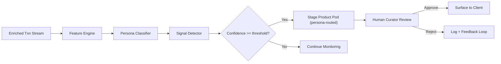
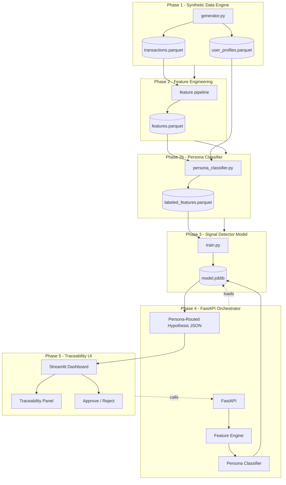

# Wealthsimple Pulse -- PoC Project Plan (v2: 2026 Wealth-Tier Personas)

## 1. Executive Summary and Business Logic

**Problem:** Wealthsimple's 2026 growth hinges on converting retail users into Premium ($100k+ AUA) and Generation ($500k+ AUA) clients who drive high-margin revenue through complex products (Private Equity, Direct Indexing, Private Credit). Today, these conversions depend on users self-discovering products -- a reactive model that leaves money on the table.

**Solution:** Wealthsimple Pulse is a *Signal Engine* that continuously analyzes enriched transaction data to (a) classify users into wealth-tier personas, (b) detect the behavioral signals that indicate readiness for a specific high-margin product, and (c) stage a traceable product recommendation for human curator approval.

**Business logic flow:**




**Three wealth-tier personas (PoC scope):**

- **The Aspiring Affluent** ($50k-$100k AUA): Wants Premium status but lacks the $100k threshold. High savings rate, high inferred tax bracket, low total AUA. **Product:** Retirement Accelerator (RRSP Loan) to leapfrog into Premium. **AI Hook -- "The Leapfrog Signal":** Detects unused RRSP contribution room and predicts the precise loan amount that triggers a Premium upgrade.
- **The Sticky Family Leader** ($100k-$500k AUA): Managing multiple accounts (RESP, TFSA, Corporate). High friction. High travel/dining credit card spend paired with large Summit Portfolio transfers. **Product:** Wealthsimple Credit Card + Summit Portfolio (Private Equity). **AI Hook -- "The Liquidity Watchdog":** Monitors credit card spend vs. illiquid Summit allocation to prevent cash-lock, ensuring the client never over-allocates.
- **The Generation Nerd** ($500k+ AUA): Sophisticated, time-poor. Wants institutional-grade analysis. **Product:** AI Research Dashboard + Direct Indexing + Private Credit. **AI Hook -- "The Analyst-in-Pocket":** Summarizes earnings calls for top holdings and suggests Tax-Loss Harvesting moves across the direct index.

**Human-in-the-Loop guarantee:** The model *never* surfaces a product directly to a client. A Financial Curator sees the AI's hypothesis, confidence score, the traceability panel (Spending Buffer, Target Product Yield, Audit Log), then makes the final decision.

---

## 2. System Architecture -- "The Signal Engine"




---

## 3. Project Directory Structure

```
LifeEventPredictor/
├── README.md
├── project_plan.md
├── pyproject.toml
├── requirements.txt
├── .gitignore
│
├── config/
│   └── settings.yaml           # persona thresholds, MCC maps, product definitions
│
├── data/
│   ├── raw/                    # generated parquet files
│   └── processed/              # engineered feature tables
│
├── src/
│   ├── __init__.py
│   ├── data_generator/
│   │   ├── __init__.py
│   │   ├── profiles.py         # Faker-based user profile factory (includes AUA, RRSP room)
│   │   ├── baseline.py         # day-to-day spending noise across account_types
│   │   ├── personas.py         # wealth-tier trajectory injectors
│   │   └── generator.py        # orchestrator → parquet
│   │
│   ├── features/
│   │   ├── __init__.py
│   │   ├── temporal.py         # rolling spend velocity, savings rate delta
│   │   ├── categorical.py      # MCC entropy, category concentration
│   │   ├── wealth.py           # AUA trajectory, RRSP utilization, illiquidity ratio
│   │   └── pipeline.py         # full feature-build pipeline
│   │
│   ├── classifier/
│   │   ├── __init__.py
│   │   └── persona_classifier.py  # rule-based tier assignment (upstream of model)
│   │
│   ├── models/
│   │   ├── __init__.py
│   │   ├── train.py            # training entry point
│   │   ├── evaluate.py         # metrics, confusion matrix, threshold tuning
│   │   └── predict.py          # single-user inference wrapper
│   │
│   └── utils/
│       ├── __init__.py
│       ├── mcc_codes.py        # MCC code → category lookup
│       └── io.py               # parquet read/write helpers
│
├── api/
│   ├── __init__.py
│   ├── main.py                 # FastAPI app factory
│   ├── routes/
│   │   ├── __init__.py
│   │   ├── predict.py          # POST /predict → persona-routed hypothesis
│   │   └── health.py           # GET /health
│   └── schemas.py              # Pydantic request/response models
│
├── ui/
│   └── app.py                  # Streamlit traceability dashboard
│
├── notebooks/
│   └── exploration.ipynb
│
└── tests/
    ├── test_data_generator.py
    ├── test_features.py
    ├── test_persona_classifier.py
    └── test_api.py
```

---

## 4. Core Data Schema

### `user_profiles` table

- **user_id** (str, UUID) -- unique identifier
- **created_at** (datetime) -- account opening date
- **age** (int) -- age at creation
- **annual_income** (float) -- gross annual income (CAD)
- **province** (str) -- Canadian province code
- **rrsp_room** (float) -- unused RRSP contribution room (CAD)
- **initial_aua** (float) -- starting Assets Under Administration
- **persona** (str) -- injected label: `aspiring_affluent`, `sticky_family_leader`, `generation_nerd`, or `baseline`
- **signal_onset_date** (datetime / null) -- when the behavioral signal trajectory begins

### `transactions` table (single enriched table)

- **txn_id** (str, UUID) -- unique transaction ID
- **user_id** (str, UUID) -- FK to user_profiles
- **timestamp** (datetime) -- transaction datetime
- **account_type** (str) -- `chequing`, `credit_card`, `investment_tfsa`, `investment_rrsp`, `investment_resp`, `investment_non_reg`
- **amount** (float) -- signed amount (negative = debit)
- **merchant** (str) -- merchant display name
- **mcc** (int) -- ISO 18245 Merchant Category Code
- **mcc_category** (str) -- human-readable MCC group
- **balance_after** (float) -- running balance post-txn for this account_type
- **channel** (str) -- `pos` / `online` / `etransfer` / `ach` / `internal_transfer`

AUA is derived at query time: `SUM(balance_after)` across all `investment_`* account types for the user's latest transaction per account.

### `features` table (engineered, per user-month)

- **user_id** (str) -- FK
- **month** (date) -- observation month
- **spend_velocity_30d** (float) -- rolling 30-day total debits (chequing + credit_card)
- **spend_velocity_delta** (float) -- month-over-month change
- **mcc_entropy** (float) -- Shannon entropy of MCC distribution
- **savings_rate** (float) -- (income - debits) / income
- **savings_rate_delta** (float) -- month-over-month change
- **top_mcc_concentration** (float) -- fraction of spend in top MCC
- **txn_count_30d** (int) -- transaction volume
- **avg_txn_amount** (float) -- mean transaction size
- **aua_current** (float) -- derived total AUA at month-end
- **aua_delta** (float) -- month-over-month AUA change
- **rrsp_utilization** (float) -- (cumulative RRSP deposits) / (rrsp_room + cumulative deposits)
- **illiquidity_ratio** (float) -- illiquid investment balance / total AUA (for Summit detection)
- **credit_spend_vs_invest** (float) -- credit card debits / investment transfers ratio
- **persona_tier** (str) -- assigned by persona_classifier (not the ground-truth label)
- **label** (str) -- ground-truth signal class or `none`

### Persona-Routed Hypothesis (API response)

```json
{
  "user_id": "uuid",
  "persona_tier": "aspiring_affluent",
  "signal": "leapfrog",
  "confidence": 0.87,
  "traceability": {
    "spending_buffer": {
      "liquid_cash": 12500.00,
      "monthly_burn_rate": 3200.00,
      "months_of_runway": 3.9
    },
    "target_product": {
      "code": "RRSP_LOAN",
      "name": "Retirement Accelerator (RRSP Loan)",
      "projected_yield": "Premium status unlock ($100k+ AUA)",
      "suggested_amount": 22000.00,
      "rationale": "RRSP room of $24k detected. A $22k loan fills 92% of room, pushing AUA from $78k to $100k+."
    },
    "audit_log": [
      {"feature": "rrsp_utilization", "value": 0.12, "signal": "92% room unused"},
      {"feature": "savings_rate", "value": 0.31, "signal": "high savings rate supports loan repayment"},
      {"feature": "aua_current", "value": 78000, "signal": "$22k from Premium threshold"},
      {"feature": "aua_delta", "value": 4200, "signal": "steady $4.2k/mo growth"}
    ]
  },
  "staged_at": "2026-02-26T18:00:00Z",
  "status": "pending_review"
}
```

---

## 5. Step-by-Step Implementation Plan

### Phase 1 -- Synthetic Data Engine

**Goal:** Generate 1,000 synthetic users x 18 months of daily enriched transactions (~5M rows) across multiple account types, with injected wealth-tier persona trajectories.

**Key files:** [src/data_generator/](src/data_generator/), [config/settings.yaml](config/settings.yaml), [src/utils/mcc_codes.py](src/utils/mcc_codes.py)

1. **MCC table** (`src/utils/mcc_codes.py`): ~60 relevant MCCs grouped into categories. Must include WS-relevant categories: travel, dining, luxury (credit card signals), real-estate, financial-services/brokerage, tuition.
2. **Profiles** (`src/data_generator/profiles.py`): Faker `en_CA` locale. Each profile gets `annual_income`, `rrsp_room` (sampled based on age/income), `initial_aua` (determines starting tier). Persona assignment weighted: 40% baseline, 20% aspiring_affluent, 20% sticky_family_leader, 20% generation_nerd.
3. **Baseline transactions** (`src/data_generator/baseline.py`): For each user, generate daily transactions across account types:
  - `chequing`: payroll deposits (ACH, monthly), recurring bills, daily POS/online purchases.
  - `credit_card`: discretionary spending (dining, travel, online shopping). Distribution shaped by income bracket.
  - `investment_*`: monthly automated transfers from chequing. Amount proportional to savings rate. Split across RRSP/TFSA/RESP/non-reg based on profile.
  - Compute `balance_after` per account type as a running sum.
4. **Persona trajectory injectors** (`src/data_generator/personas.py`): After `signal_onset_date`, overlay behavioral shifts:
  - `AspiringAffluentPersona`: Gradually increase savings rate by 10-20%, increase RRSP transfer amounts, decrease discretionary credit card spend. Keep AUA climbing toward but not crossing $100k.
  - `StickyFamilyLeaderPersona`: Introduce large monthly `internal_transfer` txns to Summit-like illiquid investment. Simultaneously spike credit card travel/dining spend. Create a widening gap between illiquid allocation and liquid cash.
  - `GenerationNerdPersona`: High-frequency `investment_non_reg` transactions (simulating active trading/rebalancing). Occasional large lump-sum deposits. Diversified MCC pattern on credit card (conferences, SaaS subscriptions, professional services).
5. **Orchestrator** (`src/data_generator/generator.py`): Wire profile -> baseline -> persona overlay -> balance computation -> parquet output.
6. **Config** (`config/settings.yaml`): All tunables -- user count, time range, persona weights, MCC distributions per income bracket, AUA thresholds ($50k, $100k, $500k).

### Phase 2 -- Feature Engineering Pipeline

**Goal:** Transform raw enriched transactions into a user-month feature matrix with wealth-tier-specific signals.

**Key files:** [src/features/temporal.py](src/features/temporal.py), [categorical.py](src/features/categorical.py), [wealth.py](src/features/wealth.py), [pipeline.py](src/features/pipeline.py)

1. `**temporal.py`**: Rolling 30-day spend velocity (chequing + credit_card debits), month-over-month velocity delta, savings rate (inferred from income deposits vs. total outflows), savings rate delta.
2. `**categorical.py**`: Shannon entropy of MCC distribution per month, top-MCC concentration, new-MCC-appearance flags (first-time appearance of signal MCCs).
3. `**wealth.py**` (new): Wealth-tier-specific features:
  - `aua_current`: Sum of latest `balance_after` across all `investment_*` accounts.
  - `aua_delta`: Month-over-month AUA change.
  - `rrsp_utilization`: Cumulative RRSP deposits / total RRSP room.
  - `illiquidity_ratio`: Illiquid investment balance / total AUA.
  - `credit_spend_vs_invest`: Monthly credit card debits / monthly investment transfers.
4. `**pipeline.py**`: Orchestrate all feature builders, join with profiles for labels, write `features.parquet`.

### Phase 2b -- Persona Classifier

**Goal:** A deterministic, rule-based module that assigns each user to a wealth tier *before* the ML model runs. This ensures the downstream model only predicts the *signal* (leapfrog, watchdog, analyst), not the tier.

**Key file:** [src/classifier/persona_classifier.py](src/classifier/persona_classifier.py)

Rules (from `config/settings.yaml`):

- `aua_current < 100_000 AND aua_current >= 50_000` -> `aspiring_affluent`
- `aua_current >= 100_000 AND aua_current < 500_000` -> `sticky_family_leader`
- `aua_current >= 500_000` -> `generation_nerd`
- `aua_current < 50_000` -> `not_eligible` (excluded from recommendations)

The classifier runs on each user-month row and writes `persona_tier` into the feature table.

### Phase 3 -- Predictive Model (Signal Detector)

**Goal:** Train a per-persona signal detector. Instead of one monolithic classifier, train a binary model per persona tier that detects whether the user is exhibiting the target signal.

**Key files:** [src/models/train.py](src/models/train.py), [evaluate.py](src/models/evaluate.py), [predict.py](src/models/predict.py)

1. `**train.py`**: Filter `labeled_features.parquet` by `persona_tier`. For each tier, train a binary classifier:
  - Aspiring Affluent: `label in {leapfrog_ready, none}` -- features emphasize `rrsp_utilization`, `savings_rate_delta`, `aua_delta`.
  - Sticky Family Leader: `label in {liquidity_warning, none}` -- features emphasize `illiquidity_ratio`, `credit_spend_vs_invest`, `spend_velocity_delta`.
  - Generation Nerd: `label in {harvest_opportunity, none}` -- features emphasize `aua_delta`, `txn_count_30d` (high-frequency trading signal), `mcc_entropy`.
  - Start with scikit-learn Random Forest, then XGBoost. Serialize per-persona models.
  - Split by user_id (not row) to prevent data leakage.
2. `**evaluate.py**`: Per-persona classification report. Optimize for **high precision** (fewer false positives = fewer bad recommendations to curators). Threshold tuning per model.
3. `**predict.py`**: `predict_signal(user_features: dict, persona_tier: str) -> SignalHypothesis`. Loads the correct per-persona model, runs inference, constructs the traceability evidence from feature values.
4. **Abstract interface**: `BaseSignalModel` ABC so a PyTorch TCN can be swapped in later.

### Phase 4 -- Headless Orchestrator (FastAPI)

**Goal:** Persona-routed REST API. The response schema changes based on the detected persona tier.

**Key files:** [api/main.py](api/main.py), [api/routes/predict.py](api/routes/predict.py), [api/schemas.py](api/schemas.py)

1. `**schemas.py`**: Pydantic models:
  - `TransactionIn` (single txn with `account_type`)
  - `PredictRequest` (user_id + list of transactions)
  - `TraceabilityEvidence` (spending_buffer, target_product, audit_log)
  - `SignalHypothesis` (persona_tier, signal, confidence, traceability, recommended_product, status)
  - Per-persona product definitions:
    - Aspiring Affluent -> `RRSP_LOAN` with computed suggested_amount
    - Sticky Family Leader -> `SUMMIT_PORTFOLIO` + `WS_CREDIT_CARD` with liquidity warning
    - Generation Nerd -> `AI_RESEARCH` + `TAX_LOSS_HARVEST` with specific holding/lot data
2. `**routes/predict.py**`: `POST /predict`:
  - Run feature pipeline on submitted transactions.
  - Run persona classifier to determine tier.
  - If `not_eligible`, return early with no recommendation.
  - Route to the correct per-persona model.
  - Build the full `SignalHypothesis` with traceability evidence.
3. `**routes/health.py**`: `GET /health` -- model versions, per-persona model load status, uptime.
4. `**main.py**`: FastAPI app factory with lifespan context manager that loads all three persona models on startup.

### Phase 5 -- Human-in-the-Loop Traceability UI (Streamlit)

**Goal:** A curator dashboard that emphasizes *traceability* -- every recommendation must show the Spending Buffer, Target Product Yield, and full Audit Log.

**Key file:** [ui/app.py](ui/app.py)

1. **Queue view**: Table of all pending `SignalHypothesis` records. Columns: user_id, persona_tier, signal type, confidence, staged product, timestamp. Filterable by persona tier. Color-coded confidence (green/yellow/red).
2. **Detail view** (on selecting a row):
  - **Spending Buffer panel**: Liquid cash, monthly burn rate, months of runway. Displayed as a metric card with a traffic-light indicator.
  - **Target Product Yield panel**: Product name, projected yield/outcome (e.g., "Premium status unlock"), suggested amount, rationale text.
  - **Audit Log panel**: Expandable table of every feature that contributed to the signal, with value, threshold, and plain-English explanation.
  - **Trajectory charts**: Line chart of AUA over time with the $100k/$500k thresholds marked. Stacked area of MCC category mix. Rolling spend velocity.
3. **Action bar**: "Approve" and "Reject" buttons. On reject, capture a reason (dropdown: "Insufficient evidence", "Client risk concern", "Timing not right", "Other"). Log all decisions for feedback loop.
4. **Styling**: Clean, professional Streamlit theme. Wealthsimple-inspired dark palette if feasible.

---

## 6. Dependency Manifest (requirements.txt)

```
pandas
numpy
faker
pyarrow
pyyaml
scikit-learn
xgboost
fastapi
uvicorn[standard]
pydantic
streamlit
plotly
joblib
pytest
httpx
```

---

## 7. Milestones and Definition of Done

- **Phase 1 done**: `data/raw/transactions.parquet` contains ~5M enriched rows across 1,000 users with `account_type` column and verifiable persona labels. AUA can be derived from investment account balances.
- **Phase 2 done**: `data/processed/features.parquet` includes wealth-tier features (`aua_current`, `rrsp_utilization`, `illiquidity_ratio`, `credit_spend_vs_invest`). Spot-check: aspiring_affluent users show rising `rrsp_utilization` after onset.
- **Phase 2b done**: `persona_classifier.py` correctly bins users into tiers based on AUA thresholds. `labeled_features.parquet` has both `persona_tier` and ground-truth `label`.
- **Phase 3 done**: Per-persona binary classifiers achieve >= 0.80 precision on held-out users. Three serialized models in `data/`.
- **Phase 4 done**: `POST /predict` returns a persona-routed `SignalHypothesis` JSON with full traceability block. Response varies by detected tier.
- **Phase 5 done**: Streamlit app renders queue, traceability panels (Spending Buffer, Target Product Yield, Audit Log), and approve/reject flow end-to-end.

